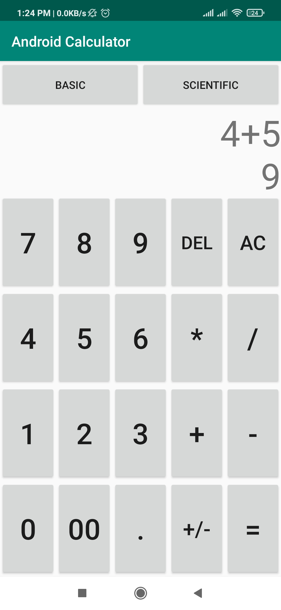
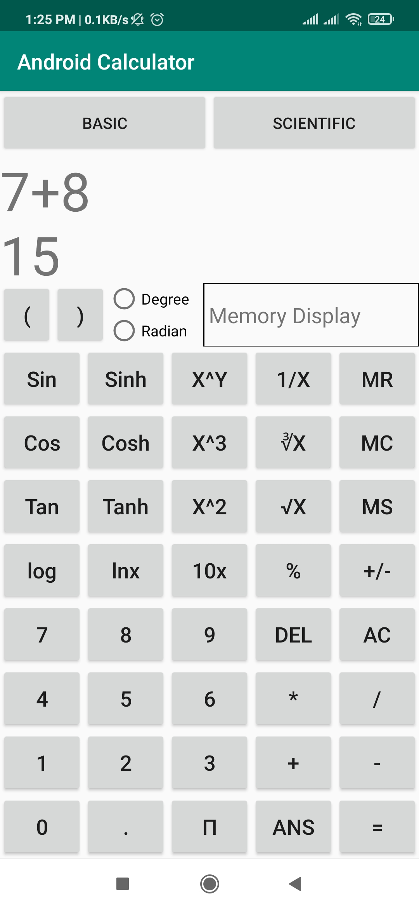

# Android Calculator.

This is an android calculator project.

Unlike other services, It is free and open source.  

It is not available on the Google Play Store. Soon it will be available on the Google Play Store and F-Droid.

  

        

## About

Android Calculator has been made for you to calculate some basic and scientific operation of our daily life.

This android application allows you to calculate arithematic operation in Basic mode and scientific operaton in scientific mode.

This application was originally created by Md Saif Hossain and not released yet.

## Features

The android app lets you:
- Standard Calculator functionality which offers basic operations and evaluates commands immediately as they are entered.
- Scientific Calculator functionality which offers expanded operations and evaluates commands using order of operations.

## Screenshots

## Permissions

Initially it doesn't need any permission.

The "Run at startup" permission is only used if Auto-Sync feature is enabled and is not utilised otherwise. The network access permissions are made use of for downloading content. The external storage permission is used to cache article images for viewing offline.

## Reference
- [Wallabag](https://github.com/wallabag/android-app)
- [Calculator](https://github.com/microsoft/calculator)

## License

This application is not released any (see [LICENSE](LICENSE)).
